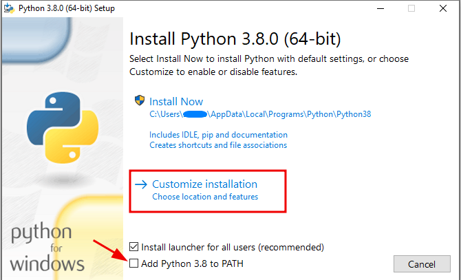

## setting up python 
***windows***
https://docs.python.org/3/using/windows.html

while installing please make sure to check "Add Python 3.12 to PATH" so don't have 
to go for installation overhead.



***download 3.12.5:***
https://www.python.org/downloads/windows/ <br>

#####################################################################################<br>

***mac***
https://docs.python.org/3/using/mac.html

***download 3.12.5:*** 
https://www.python.org/downloads/macos/

## setting up & running 
windows
```
1. clone the repository
2. cd into the cloned directory
3. create .env file and set the necessary variables
    AWS_ACCESS_KEY_ID=xxxxxxxxxxxxxxxxxxxxxxxxxxxx
    AWS_SECRET_ACCESS_KEY=xxxxxxxxxxxxxxxxxxxxxxxx
    AWS_DEFAULT_REGION=us-east-1
    DISTRIBUTION_ID_1=xxxxxxxxxxxxx
    DISTRIBUTION_ID_2=xxxxxxxxxxxxx
4. create venv  with  'python -m venv venv'  
5. activate venv wiht 'source venv/Scripts/activate  **(for mac & linux)** 'source venv/bin/activate'
6. pip install -r requirements.txt
7. run the scrip  with ' python script.py'
8. enter your choice when promted and invalidate your cf distribution
```
